## SECTION 1 : PROJECT TITLE
## School Recommender

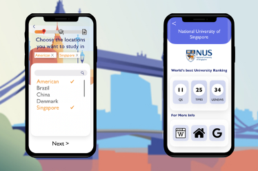

---

## SECTION 2 : EXECUTIVE SUMMARY
In 2019 , the number of oversea Chinese students reached 710,000. The United States is still having the largest number of Chinese students. The number of students studying in the UK has increased significantly, the number of students studying in Asia, Singapore, Japan and South Korea has steadily increased. Countries studying abroad for Chinese students are becoming more and more diverse and the group of students studying abroad is growing.

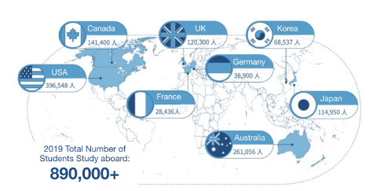

Indeed, Most Chinese students decide to study abroad after obtaining their bachelor's degree in China. Students in China usually apply for oversea Mater or straight to PhD programs to further develop their potential as intellectual leaders for a wide range of career paths based on their undergraduate school, GPA, TOEFL/IELTS/GRE and other experience.

There are usually three ways for students to collect information and choose their target school. To begin with, the most common way is by themselves. This seems to be a fast and economic mode, however due to lack of experience and limited energy for single person, it’s difficult and time consuming for them to find useful information from large amount of college information. The Second way is seeking help from experienced relatives and friends. They can provide truthful and in-depth information, but too often their information are  only applies to their own background and maybe out of date. Last but no least, consulting a study abroad agency is the most efficient way to find the right school for you since they have been equipped with rich experience in varieties of cases. But the consulting fee is often too high to afford for most of students.

Our project team is dedicated in assisting students find the most suitable colleges and major by taking advantage of the rich case experience of study abroad agencies. First We collected study abroad application data from study abroad agency and apply machine reasoning to prepare our knowledge base and evaluate students background. Secondly, we have made use of decision tree and retrieval model to match the student’s background with that in our knowledge base to help students find out the most suitable school and major. Further to that, we have provide the QS, TIMES, USNEWS world university ranking data and related information for the target school.

Our project team hopes that with our solution, the students will be able to find the school that suits their specific background most.

---

## SECTION 3 : CREDITS / PROJECT CONTRIBUTION

| Official Full Name  | Student ID (MTech Applicable)  | Work Items (Who Did What) | Email (Optional) |
| :------------ |:---------------:| :-----| :-----|
| Cao Wen | A0215516L | 1. Data Acquisition 2. Data Processing 3. User Interface development 4. Django & Database development 5. Project report writing | caowen@u.nus.edu |
| Lin Xi | A0215403W | 1. Product prototype design 2. System architecture design 3. Data Processing 4. User Interface development 5. Django & Database development 6. Project report writing | linxi@u.nus.edu |
| Liu Chenxi | A0215461M | 1. System architecture design 2. Data Acquisition 3. Data Processing 4. Retrieval model development 5. User Interface development 6. Project report writing | E0535551@u.nus.edu |
| Zheng Kai | A0215414R | 1. Data Processing 2. Decision Table 3. Decision Tree development 4. Project report writing | kzheng@u.nus.edu |

---

## SECTION 4 : VIDEO OF SYSTEM MODELLING & USE CASE DEMO

---

## SECTION 5 : USER GUIDE

`Refer to appendix <Installation & User Guide> in project report at Github Folder: ProjectReport`

### To run the system in other/local machine:
#### Requirements

> Enter folder
>
> $ cd SystemCode/proj1Django-master/
>
> Install dependencies
>
> $ conda create -n proj1 python=3.6
>
> $ conda activate proj1
>
> $ pip install -r requirements
>
> Data base import(refer to Database Deployment.pdf)
>
> run server
>
> $ run server localhost:8088

> Enter folder SystemCode/schoolRecommend/
>
> Start web application, click index.html

#### User Guide

1. Click “START” button to start using school recommender application

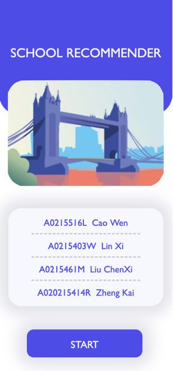

2. Enter study location select page, check the checkbox of the locations you want to study in. The progress bar on the top the page show the progress of your information input.

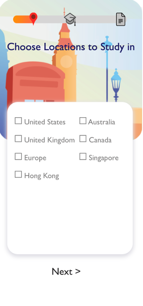

3. The selected locations will show on the page, after location selection is completed, click ‘Next’.

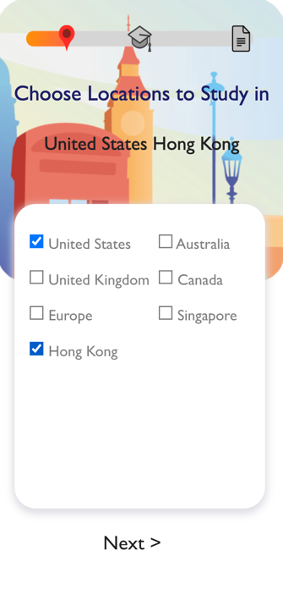

4. Enter education background information page, you can provide your basic education information. The item with ‘*’ is required information, complete all the require information can give you a accurate evaluation result. When you finish all the required information, click”Next”.

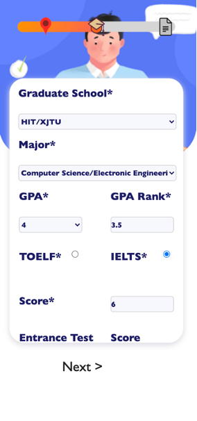

5. Enter other information page. In this page you can enter the other related background information.

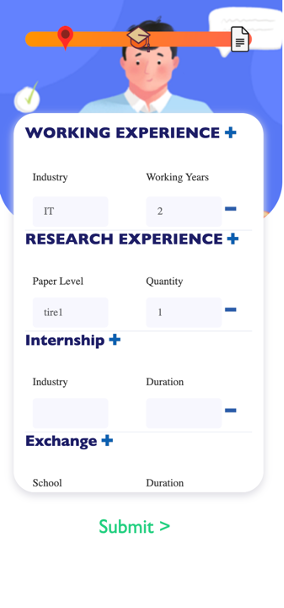

6. if you have more than one record, you can click “+” button to add the input field. Meanwhile, if you want to delete the extra input field, you can click ’-’, on the right of the input cell.

7. After you finished providing all the background information, and reviewed your inputs, you can click “submit” to send your information to our AI model to generate the recommendation report for you based on your background information.

8. In Recommend Report page, there are three parts. The first parts is on the upper left, which shows your background information evaluation score has exceed how many percentage of other users.

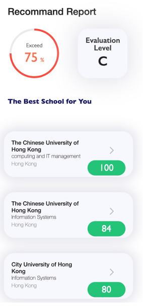

9. The “Evaluation Level” on the upper right, shows your overall background information evaluation level. We have overall five level of background, from high to low are “S”,”A”,”B”,”C”,”D”.

10. click the “Evaluation Level” panel, the detailed evaluation of the user background information will show. Click again, then will return to the previous panel.

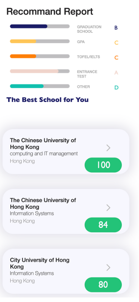

11. the bottom part of the recommend report shows the list of recommended school for users. Contains school name, major, location and the recommend score, higher the recommend score means the school is more suitable for you.

12. Click the school you are interested in , will jump to the school detail information page.
13. The world’s best University Ranking shows the rank of this school in QS, TIMES and USNEWS world best university ranking.

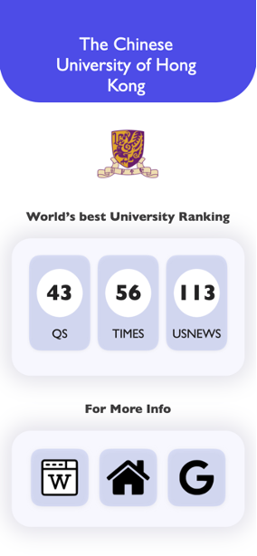

14. In “For more info” panel there are 3 buttons. Clicking first one can access to the wikipedia of the school; clicking second one will navigate you to the homepage of this school. Click last one will google the school’s information for you.

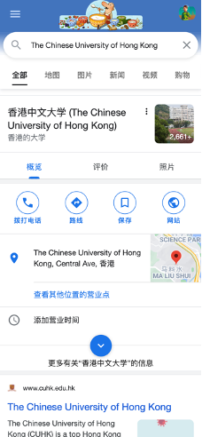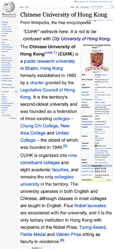

---
## SECTION 6 : PROJECT REPORT / PAPER

`Refer to project report at Github Folder: ProjectReport`

**Sections for Project Report**

- Executive Summary
- Business Justification
- Project Team
  - Project Objective
  - Team Members
- Project Solution
  - Project Deliverables
    - Application Features
    - Application Business Flow
  - Knowledge Representation
    - Data Acquisition and Cleansing
    - Database Structure
- Project Architecture & Implementation
  - Architecture Overview
  - Process Flow
  - System Modules
    - Decision Table
    - Decision Tree
    - Retrieval Model
    - User interface
    - Backend
- Project Performance & Validation
  - Dataset and Evaluation Matrix
  - Evaluation
- Challenge & Recommendation
  - Challenges
    - Data Acquisition via Web Crawling
    - Reaching out to the Public
  - Future Improvements
    - Better Data Acquisition
    - Better and More Accurate Decision Models
- APPENDIX OF REPORT

---
## SECTION 7 : Miscellaneous

`Refer to Github Folder: Miscellaneous`
### JiTuoTianXia.xlsx
- Application data that we crawled from the 'JITUOTIANXIA' website
### Bupt.xlsx
- Application data that we crawled from the 'BEIYOUREN' forum

---

**This [Machine Reasoning (MR)](https://www.iss.nus.edu.sg/executive-education/course/detail/machine-reasoning "Machine Reasoning") course is part of the Analytics and Intelligent Systems and Graduate Certificate in [Intelligent Reasoning Systems (IRS)](https://www.iss.nus.edu.sg/stackable-certificate-programmes/intelligent-systems "Intelligent Reasoning Systems") series offered by [NUS-ISS](https://www.iss.nus.edu.sg "Institute of Systems Science, National University of Singapore").**

**Lecturer: [GU Zhan (Sam)](https://www.iss.nus.edu.sg/about-us/staff/detail/201/GU%20Zhan "GU Zhan (Sam)")**

**zhan.gu@nus.edu.sg**

